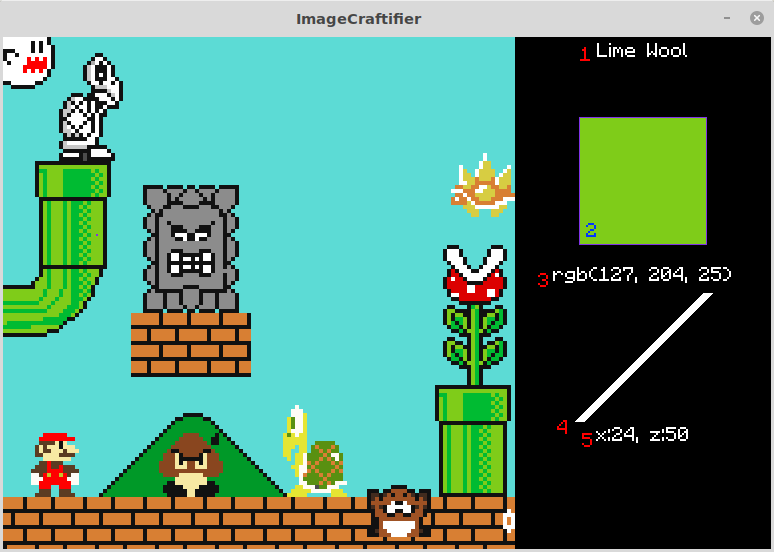

# ImageCraftifier
 Converts an image to Minecraft map instuctions
## Usage
 `python3 main.py file`
 1. A "Converting" progress bar will appear while it shifts the colors to map colors.
 2. The window will morph into a viewer. Use the mouse to pick a block, and scroll or drag to move around large images.
## Info given

1. Block name(s)
2. Map color
3. RGB map color
4. Slope: left side is northward block, right side is current block
5. Position in image
